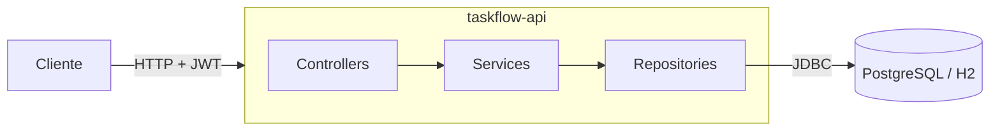

<!-- ============================================================================
     PLANTILLA de README profesional (MP-1). Copia este archivo a la RAÍZ de tu
     repo como README.md y RELLENA cada <TODO>. Borra estos comentarios al terminar.

     La prueba del clon manda: clona tu repo en un directorio limpio y corre CADA
     comando de aquí, copy-paste. Si no corre, es un bug del README.
     Modelo lleno de referencia: ../../solucion/README-ejemplo-final.md
     ============================================================================ -->

# TaskFlow API

<!-- TODO badges: sustituye <usuario> por tu owner de GitHub en MINÚSCULAS -->
[](https://github.com/<usuario>/taskflow-api-<usuario>/actions/workflows/ci-cd.yml)
[](https://github.com/<usuario>/taskflow-api-<usuario>/releases)


<!-- TODO qué es, en 3 líneas, sin jerga: qué resuelve, para quién. -->
> TODO: TaskFlow es una API REST para ___________. Permite ___________.

## Arquitectura

<!-- TODO diagrama. Mermaid (GitHub lo renderiza) o ASCII. Deben verse: las capas
     (controller → service → repository), la BD (Postgres/H2) y el pipeline al lado. -->


<!-- TODO 2 o 3 líneas describiendo las capas y que el mismo binario corre en H2 o Postgres. -->

## Cómo correr

### Camino A — dev local (H2)
```bash
git clone https://github.com/<usuario>/taskflow-api-<usuario>.git
cd taskflow-api-<usuario>
mvn spring-boot:run        # TODO: confirma que ESTE comando corre en el clon limpio
```
<!-- TODO: URL, Swagger, sanity con curl /info -->

### Camino B — Docker Compose (API + Postgres)
```bash
cp .env.example .env       # TODO: di qué variables rellenar
docker compose up -d --build
```

### Camino C — nube (opcional)
<!-- TODO: URL viva o referencia a las notas del Release. NO dejes un comando que ya no aplica. -->

## Cómo probar
```bash
mvn verify                 # suite completa + gate de cobertura JaCoCo (falla bajo 70%)
```
<!-- TODO: reporte de cobertura (target/site/jacoco/index.html) y la colección Postman. -->

### Usuarios semilla
<!-- TODO tabla: ana/ana123 (USER, owner p1), luis/luis123 (USER), admin/admin123 (ADMIN). -->

## Endpoints
<!-- TODO: lista breve + "detalle en Swagger (/swagger-ui.html)". -->

## Cómo se construye y despliega
<!-- TODO: 2-3 líneas del pipeline (test → build-and-push a GHCR → deploy). -->

## Limitaciones conocidas
<!-- TODO: honestas. Sin refresh tokens, sin paginación, un solo ambiente... (mismas que las notas de release). -->

## Licencia
<!-- TODO -->
